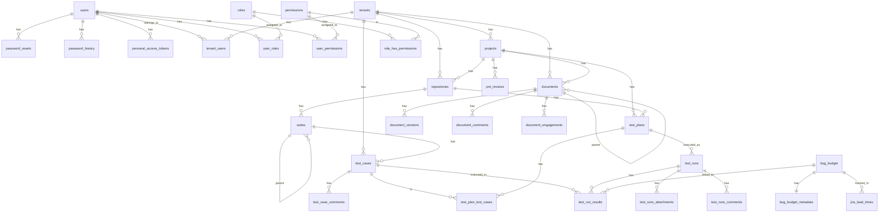

# QaHub Entity Relationship Diagram (ERD)

**Last Updated:** 2025-11-30  
**Database Type:** PostgreSQL  
**ORM:** Prisma

This document provides a comprehensive overview of the QaHub database schema, including all tables, relationships, and key constraints.

---

## 📊 Overview

The QaHub database schema is organized into 12 main domains:

1. **User Management & Authentication** - User accounts, authentication, and security
2. **Authorization & Permissions** - RBAC and permission management
3. **Multi-Tenancy** - Tenant isolation and management
4. **Projects & Repositories** - Project organization
5. **Test Planning & Organization** - Test suites, cases, and plans
6. **Test Execution & Results** - Test runs and results tracking
7. **Document Management** - Document storage and versioning
8. **PRD Review & Requirements** - PRD review system
9. **Bug Tracking & Issue Management** - Bug tracking and Jira integration
10. **Analytics & Reporting** - Test reports and metrics
11. **Analytics Summary Tables** - Pre-aggregated analytics
12. **Audit & Logging** - Audit trails and event sourcing

---

## 🔐 1. User Management & Authentication

### Core Tables

```
┌─────────────────────┐
│       users         │
├─────────────────────┤
│ id (PK)             │
│ name                │
│ email (UNIQUE)      │
│ google_id (UNIQUE)  │
│ google_avatar       │
│ auth_provider       │
│ role                │
│ avatar              │
│ last_login_at       │
│ password_changed_at │
│ is_active           │
│ email_verified_at   │
│ password            │
│ job_role            │
│ remember_token      │
│ created_at          │
│ updated_at          │
└─────────────────────┘
         │
         │ 1:N
         ├─────────────────┐
         │                 │
         ▼                 ▼
┌──────────────────┐  ┌──────────────────────┐
│ password_resets  │  │ password_history     │
├──────────────────┤  ├──────────────────────┤
│ email            │  │ id (PK)              │
│ user_id (FK)     │◄─┤ user_id (FK)        │
│ token (UNIQUE)   │  │ password_hash        │
│ used_at          │  │ password_reset_id    │
│ expires_at       │  │ created_at           │
│ created_at       │  └──────────────────────┘
└──────────────────┘
         │
         │ 1:N
         ▼
┌──────────────────────────┐
│ personal_access_tokens   │
├──────────────────────────┤
│ id (PK)                  │
│ tokenable_type           │
│ tokenable_id             │
│ name                     │
│ token (UNIQUE)           │
│ token_hash (UNIQUE)      │
│ abilities                │
│ last_used_at             │
│ last_used_ip             │
│ last_used_user_agent     │
│ expires_at               │
│ revoked_at               │
│ revoked_by (FK → users)  │
│ created_at               │
│ updated_at               │
└──────────────────────────┘
```

### Relationships

- **users** → **password_resets** (1:N) - `user_id` FK
- **users** → **password_history** (1:N) - `user_id` FK
- **users** → **personal_access_tokens** (1:N) - `tokenable_id` (polymorphic)
- **password_resets** → **password_history** (1:1) - `password_reset_id` FK (optional)
- **users** → **personal_access_tokens** (1:N) - `revoked_by` FK

---

## 🔑 2. Authorization & Permissions

### Core Tables

```
┌──────────────────┐         ┌──────────────────┐
│   permissions    │         │      roles       │
├──────────────────┤         ├──────────────────┤
│ id (PK)          │         │ id (PK)          │
│ name             │         │ name             │
│ guard_name       │         │ guard_name       │
│ created_at       │         │ created_at       │
│ updated_at       │         │ updated_at       │
└──────────────────┘         └──────────────────┘
         │                            │
         │                            │
         │ M:N                        │ M:N
         │                            │
         ├──────────────┐             │
         │              │             │
         ▼              ▼             ▼
┌──────────────────┐  ┌──────────────────┐  ┌──────────────────┐
│ user_permissions│  │role_has_permissions│  │   user_roles    │
├──────────────────┤  ├──────────────────┤  ├──────────────────┤
│ user_id (FK)     │  │ permission_id(FK)│  │ user_id (FK)     │
│ permission_id(FK)│  │ role_id (FK)     │  │ role_id (FK)     │
│ created_at       │  │ created_at       │  │ created_at       │
│ updated_at       │  │ updated_at       │  │ updated_at       │
└──────────────────┘  └──────────────────┘  └──────────────────┘
         │
         │
         │ (deprecated)
         │
         ▼
┌──────────────────────┐
│model_has_permissions │
├──────────────────────┤
│ permission_id (FK)   │
│ model_type           │
│ model_id             │
│ created_at           │
│ updated_at           │
└──────────────────────┘

┌──────────────────┐
│ model_has_roles  │
├──────────────────┤
│ role_id (FK)     │
│ model_type       │
│ model_id         │
│ created_at       │
│ updated_at       │
└──────────────────┘
```

### Relationships

- **users** → **user_permissions** (1:N) - `user_id` FK
- **permissions** → **user_permissions** (1:N) - `permission_id` FK
- **users** → **user_roles** (1:N) - `user_id` FK
- **roles** → **user_roles** (1:N) - `role_id` FK
- **roles** → **role_has_permissions** (1:N) - `role_id` FK
- **permissions** → **role_has_permissions** (1:N) - `permission_id` FK
- **permissions** → **model_has_permissions** (1:N) - `permission_id` FK (deprecated)
- **roles** → **model_has_roles** (1:N) - `role_id` FK (deprecated)

---

## 🏢 3. Multi-Tenancy

### Core Tables

```
┌──────────────────┐
│     tenants      │
├──────────────────┤
│ id (PK)          │
│ name (UNIQUE)     │
│ slug (UNIQUE)     │
│ domain (UNIQUE)   │
│ subdomain(UNIQUE)│
│ plan              │
│ status            │
│ max_users         │
│ max_projects      │
│ features (JSON)   │
│ billing_email     │
│ subscription_id   │
│ trial_ends_at     │
│ created_at        │
│ updated_at        │
└──────────────────┘
         │
         │ 1:N
         ▼
┌──────────────────┐
│   tenant_users   │
├──────────────────┤
│ tenant_id (FK)   │
│ user_id (FK)      │
│ role              │
│ invited_by (FK)   │
│ joined_at         │
│ created_at        │
└──────────────────┘
         │
         │ N:1
         ▼
┌──────────────────┐
│      users        │
└──────────────────┘
```

### Relationships

- **tenants** → **tenant_users** (1:N) - `tenant_id` FK
- **users** → **tenant_users** (1:N) - `user_id` FK
- **users** → **tenant_users** (1:N) - `invited_by` FK

### Tenant-Scoped Tables

All tenant-scoped tables include `tenant_id` FK:
- `projects` → `tenants`
- `repositories` → `tenants`
- `test_cases` → `tenants`
- `documents` → `tenants`

---

## 📁 4. Projects & Repositories

### Core Tables

```
┌──────────────────┐
│     tenants      │
└──────────────────┘
         │
         │ 1:N
         ▼
┌──────────────────┐
│    projects      │
├──────────────────┤
│ id (PK)          │
│ tenant_id (FK)   │
│ title             │
│ description       │
│ created_by (FK)   │
│ updated_by (FK)   │
│ created_at        │
│ updated_at        │
└──────────────────┘
         │
         │ 1:N
         ▼
┌──────────────────┐
│  repositories    │
├──────────────────┤
│ id (PK)          │
│ tenant_id (FK)    │
│ project_id (FK)   │
│ title             │
│ prefix            │
│ description       │
│ created_by (FK)   │
│ updated_by (FK)   │
│ created_at        │
│ updated_at        │
└──────────────────┘

┌──────────────────┐
│    settings      │
├──────────────────┤
│ id (PK)          │
│ key (UNIQUE)      │
│ value             │
│ type              │
│ category          │
│ description       │
│ created_by (FK)   │
│ updated_by (FK)   │
│ created_at        │
│ updated_at        │
└──────────────────┘
```

### Relationships

- **tenants** → **projects** (1:N) - `tenant_id` FK
- **users** → **projects** (1:N) - `created_by`, `updated_by` FK
- **projects** → **repositories** (1:N) - `project_id` FK
- **tenants** → **repositories** (1:N) - `tenant_id` FK
- **users** → **repositories** (1:N) - `created_by`, `updated_by` FK
- **users** → **settings** (1:N) - `created_by`, `updated_by` FK

---

## 🧪 5. Test Planning & Organization

### Core Tables

```
┌──────────────────┐
│  repositories    │
└──────────────────┘
         │
         │ 1:N
         ▼
┌──────────────────┐
│     suites       │
├──────────────────┤
│ id (PK)          │
│ repository_id(FK)│
│ parent_id (FK)   │◄──┐ (self-ref)
│ title             │  │
│ order             │  │
│ created_by (FK)   │  │
│ updated_by (FK)   │  │
│ created_at        │  │
│ updated_at        │  │
└──────────────────┘  │
         │            │
         │ 1:N        │
         ▼            │
┌──────────────────┐ │
│   test_cases     │ │
├──────────────────┤ │
│ id (PK)          │ │
│ tenant_id (FK)   │ │
│ suite_id (FK)    │ │
│ title             │ │
│ description       │ │
│ labels            │ │
│ automated         │ │
│ priority          │ │
│ data (JSON)       │ │
│ order             │ │
│ regression        │ │
│ epic_link         │ │
│ linked_issue      │ │
│ jira_key          │ │
│ platform          │ │
│ release_version   │ │
│ severity          │ │
│ defect_stage      │ │
│ version           │ │
│ created_by (FK)   │ │
│ updated_by (FK)   │ │
│ deleted_by (FK)   │ │
│ deleted_at        │ │
│ created_at        │ │
│ updated_at        │ │
└──────────────────┘ │
         │            │
         │ 1:N        │
         ▼            │
┌──────────────────┐ │
│test_case_comments│ │
├──────────────────┤ │
│ id (PK)          │ │
│ test_case_id(FK) │ │
│ user_id (FK)     │ │
│ parent_id (FK)   │─┘ (self-ref)
│ content           │
│ is_resolved       │
│ created_at        │
│ updated_at        │
│ deleted_at        │
└──────────────────┘

┌──────────────────┐
│   test_plans     │
├──────────────────┤
│ id (PK)          │
│ project_id (FK)  │
│ repository_id(FK)│
│ title             │
│ description       │
│ status            │
│ data (DEPRECATED) │
│ created_by (FK)   │
│ updated_by (FK)   │
│ created_at        │
│ updated_at        │
└──────────────────┘
         │
         │ 1:N
         ▼
┌──────────────────────┐
│test_plan_test_cases  │
├──────────────────────┤
│ test_plan_id (FK)    │
│ test_case_id (FK)    │
│ order                │
│ created_at           │
└──────────────────────┘
         │
         │ N:1
         ▼
┌──────────────────┐
│   test_cases     │
└──────────────────┘
```

### Relationships

- **repositories** → **suites** (1:N) - `repository_id` FK
- **suites** → **suites** (1:N) - `parent_id` FK (self-referential)
- **suites** → **test_cases** (1:N) - `suite_id` FK
- **tenants** → **test_cases** (1:N) - `tenant_id` FK
- **users** → **test_cases** (1:N) - `created_by`, `updated_by`, `deleted_by` FK
- **test_cases** → **test_case_comments** (1:N) - `test_case_id` FK
- **test_case_comments** → **test_case_comments** (1:N) - `parent_id` FK (self-referential)
- **users** → **test_case_comments** (1:N) - `user_id` FK
- **projects** → **test_plans** (1:N) - `project_id` FK
- **repositories** → **test_plans** (1:N) - `repository_id` FK
- **test_plans** → **test_plan_test_cases** (1:N) - `test_plan_id` FK
- **test_cases** → **test_plan_test_cases** (1:N) - `test_case_id` FK

---

## 🏃 6. Test Execution & Results

### Core Tables

```
┌──────────────────┐
│   test_plans     │
└──────────────────┘
         │
         │ 1:N
         ▼
┌──────────────────┐
│   test_runs      │
├──────────────────┤
│ id (PK)          │
│ test_plan_id(FK) │
│ project_id (FK)   │
│ repository_id(FK) │
│ title             │
│ status            │
│ execution_date    │
│ started_at        │
│ completed_at      │
│ environment       │
│ build_version     │
│ data (DEPRECATED) │
│ created_by (FK)   │
│ updated_by (FK)   │
│ created_at        │
│ updated_at        │
└──────────────────┘
         │
         │ 1:N
         ├──────────────┬──────────────┐
         │              │              │
         ▼              ▼              ▼
┌──────────────────┐ ┌──────────────┐ ┌──────────────────┐
│test_run_results  │ │test_runs_    │ │test_runs_comments│
│                  │ │attachments   │ │                  │
├──────────────────┤ ├──────────────┤ ├──────────────────┤
│ id (PK)          │ │ id (PK)      │ │ id (PK)          │
│ test_run_id (FK) │ │ url          │ │ user_id (FK)     │
│ test_case_id(FK) │ │ test_run_id  │ │ comments         │
│ status           │ │ test_case_id │ │ test_run_id (FK) │
│ execution_time   │ │ uploaded_by  │ │ test_plan_id(FK) │
│ error_message    │ │ created_at   │ │ created_at       │
│ stack_trace      │ └──────────────┘ │ updated_at       │
│ screenshots(JSON) │                 └──────────────────┘
│ logs              │
│ defect_found_at   │
│ bug_budget_id(FK)│
│ defect_severity   │
│ executed_by (FK)  │
│ executed_at       │
│ retry_count       │
│ created_at        │
└──────────────────┘
         │
         │ N:1
         ▼
┌──────────────────┐
│   test_cases     │
└──────────────────┘
```

### Relationships

- **test_plans** → **test_runs** (1:N) - `test_plan_id` FK
- **projects** → **test_runs** (1:N) - `project_id` FK
- **repositories** → **test_runs** (1:N) - `repository_id` FK
- **users** → **test_runs** (1:N) - `created_by`, `updated_by` FK
- **test_runs** → **test_run_results** (1:N) - `test_run_id` FK
- **test_cases** → **test_run_results** (1:N) - `test_case_id` FK
- **users** → **test_run_results** (1:N) - `executed_by` FK
- **bug_budget** → **test_run_results** (1:N) - `bug_budget_id` FK
- **test_runs** → **test_runs_attachments** (1:N) - `test_run_id` FK
- **test_cases** → **test_runs_attachments** (1:N) - `test_case_id` FK
- **users** → **test_runs_attachments** (1:N) - `uploaded_by` FK
- **test_runs** → **test_runs_comments** (1:N) - `test_run_id` FK
- **test_plans** → **test_runs_comments** (1:N) - `test_plan_id` FK
- **users** → **test_runs_comments** (1:N) - `user_id` FK

---

## 📄 7. Document Management

### Core Tables

```
┌──────────────────┐
│     tenants      │
└──────────────────┘
         │
         │ 1:N
         ▼
┌──────────────────┐
│    projects      │
└──────────────────┘
         │
         │ 1:N
         ▼
┌──────────────────┐
│    documents     │
├──────────────────┤
│ id (PK)          │
│ tenant_id (FK)   │
│ project_id (FK)  │
│ parent_id (FK)   │◄──┐ (self-ref)
│ title             │  │
│ content           │  │
│ content_id (FK)   │  │
│ version           │  │
│ created_by (FK)   │  │
│ last_edited_by(FK)│ │
│ deleted_by (FK)   │  │
│ views_count       │  │
│ likes_count       │  │
│ stars_count       │  │
│ deleted_at        │  │
│ created_at        │  │
│ updated_at        │  │
└──────────────────┘  │
         │             │
         │ 1:N         │
         ├─────────────┼──────────────┐
         │             │              │
         ▼             ▼              ▼
┌──────────────────┐ ┌──────────────┐ ┌──────────────────┐
│document_versions │ │document_     │ │document_         │
│                  │ │comments      │ │engagements       │
├──────────────────┤ ├──────────────┤ ├──────────────────┤
│ id (PK)          │ │ id (PK)      │ │ id (PK)          │
│ document_id (FK) │ │ document_id  │ │ document_id (FK)│
│ title             │ │ document_   │ │ user_id (FK)     │
│ content           │ │   mgr_id     │ │ engagement_type  │
│ version_number    │ │ user_id (FK) │ │ viewed_at        │
│ created_by (FK)   │ │ parent_id   │ │ created_at       │
│ change_summary    │ │ content      │ │ updated_at       │
│ created_at        │ │ comment_type │ └──────────────────┘
│ updated_at        │ │ is_resolved  │
└──────────────────┘ │ mentioned_    │
         │           │   user_ids    │
         │           │ created_at    │
         │           │ updated_at    │
         │           │ deleted_at    │
         │           └──────────────┘
         │
         │ N:1
         ▼
┌──────────────────┐
│ content_storage  │
├──────────────────┤
│ id (PK)          │
│ content_hash     │
│ content_type     │
│ content_size     │
│ storage_path     │
│ content_data     │
│ reference_count  │
│ created_at       │
│ updated_at       │
└──────────────────┘

┌──────────────────┐
│document_templates│
├──────────────────┤
│ id (PK)          │
│ name             │
│ type             │
│ content          │
│ variables (JSON) │
│ is_active        │
│ created_by (FK)  │
│ created_at       │
│ updated_at       │
└──────────────────┘

┌──────────────────┐
│  editor_images   │
├──────────────────┤
│ id (PK)          │
│ filename         │
│ original_name    │
│ path             │
│ mime_type        │
│ size             │
│ uploaded_by (FK) │
│ created_at       │
│ updated_at       │
└──────────────────┘
```

### Relationships

- **tenants** → **documents** (1:N) - `tenant_id` FK
- **projects** → **documents** (1:N) - `project_id` FK
- **documents** → **documents** (1:N) - `parent_id` FK (self-referential)
- **content_storage** → **documents** (1:N) - `content_id` FK
- **users** → **documents** (1:N) - `created_by`, `last_edited_by`, `deleted_by` FK
- **documents** → **document_versions** (1:N) - `document_id` FK
- **users** → **document_versions** (1:N) - `created_by` FK
- **documents** → **document_comments** (1:N) - `document_id` FK
- **documents_manager** → **document_comments** (1:N) - `document_manager_id` FK (deprecated)
- **document_comments** → **document_comments** (1:N) - `parent_id` FK (self-referential)
- **users** → **document_comments** (1:N) - `user_id` FK
- **documents** → **document_engagements** (1:N) - `document_id` FK
- **users** → **document_engagements** (1:N) - `user_id` FK
- **users** → **document_templates** (1:N) - `created_by` FK
- **users** → **editor_images** (1:N) - `uploaded_by` FK

---

## 📋 8. PRD Review & Requirements

### Core Tables

```
┌──────────────────┐
│    projects      │
└──────────────────┘
         │
         │ 1:N
         ▼
┌──────────────────┐
│   prd_reviews    │
├──────────────────┤
│ id (PK)          │
│ title             │
│ content           │
│ status            │
│ project_id (FK)   │
│ reviewed_by (FK) │
│ reviewed_at       │
│ comments          │
│ created_by (FK)   │
│ updated_by (FK)   │
│ created_at        │
│ updated_at        │
└──────────────────┘
         │
         │ 1:N
         ▼
┌──────────────────┐
│ prd_review_cache │
├──────────────────┤
│ id (PK)          │
│ prd_review_id(FK)│
│ cache_key(UNIQUE)│
│ cache_type       │
│ data (JSON)      │
│ expires_at       │
│ created_at       │
│ updated_at       │
└──────────────────┘
```

### Relationships

- **projects** → **prd_reviews** (1:N) - `project_id` FK
- **users** → **prd_reviews** (1:N) - `reviewed_by`, `created_by`, `updated_by` FK
- **prd_reviews** → **prd_review_cache** (1:N) - `prd_review_id` FK

---

## 🐛 9. Bug Tracking & Issue Management

### Core Tables

```
┌──────────────────┐
│    projects      │
└──────────────────┘
         │
         │ 1:N
         ▼
┌──────────────────┐
│   bug_budget     │
├──────────────────┤
│ id (PK)          │
│ jira_key(UNIQUE) │
│ project          │
│ project_id (FK)   │
│ summary           │
│ status            │
│ issue_type        │
│ final_issue_type  │
│ priority          │
│ severity_issue    │
│ sprint            │
│ status_category   │
│ assignee_final    │
│ assignee_id (FK)  │
│ reporter          │
│ reporter_id (FK)  │
│ creator           │
│ creator_id (FK)   │
│ labels            │
│ is_open           │
│ created_date      │
│ updated_date      │
│ resolved_date     │
│ due_date          │
│ last_synced_at    │
│ description       │
│ created_at        │
│ updated_at        │
└──────────────────┘
         │
         │ 1:1
         ▼
┌──────────────────┐
│bug_budget_       │
│metadata          │
├──────────────────┤
│ bug_budget_id(PK)│
│ epic_hierarchy   │
│   (JSON)         │
│ assignee_details │
│   (JSON)         │
│ date_fields      │
│   (JSON)         │
│ analysis_fields  │
│   (JSON)         │
│ classification_  │
│   fields (JSON)  │
│ report_fields    │
│   (JSON)         │
│ story_points_data│
│   (JSON)         │
│ version_fields   │
│   (JSON)         │
│ raw_jira_data    │
│   (JSON)         │
│ created_at       │
│ updated_at       │
└──────────────────┘

┌──────────────────┐
│jira_table_history│
├──────────────────┤
│ id (PK)          │
│ project          │
│ issuetype        │
│ issuekey(UNIQUE) │
│ summary          │
│ description      │
│ ... (80+ fields) │
│ raw_jira_data    │
│   (JSON)         │
│ synced_at        │
│ sync_source      │
│ jql_query_used   │
│ created_at       │
│ updated_at       │
└──────────────────┘

┌──────────────────┐
│   jira_fields    │
├──────────────────┤
│ id (PK)          │
│ field_type       │
│ field_id(UNIQUE) │
│ description      │
│ is_custom        │
│ is_active        │
│ sort_order       │
│ created_by (FK)  │
│ updated_by (FK)  │
│ created_at       │
│ updated_at       │
└──────────────────┘
```

### Relationships

- **projects** → **bug_budget** (1:N) - `project_id` FK
- **users** → **bug_budget** (1:N) - `assignee_id`, `reporter_id`, `creator_id` FK
- **bug_budget** → **bug_budget_metadata** (1:1) - `bug_budget_id` FK (PK)
- **users** → **jira_fields** (1:N) - `created_by`, `updated_by` FK

---

## 📊 10. Analytics & Reporting

### Core Tables

```
┌──────────────────┐
│  allure_report   │
├──────────────────┤
│ id (PK)          │
│ name             │
│ version          │
│ summary (JSON)   │
│ status           │
│ execution_       │
│   started_at     │
│ execution_       │
│   stopped_at     │
│ created_by (FK)  │
│ updated_by (FK)  │
│ created_at       │
│ updated_at       │
└──────────────────┘
         │
         │ 1:N
         ▼
┌──────────────────┐
│allure_scenarios  │
├──────────────────┤
│ id (PK)          │
│ allure_report_id │
│ name             │
│ status           │
│ duration         │
│ created_at       │
│ updated_at       │
└──────────────────┘
         │
         │ 1:N
         ▼
┌──────────────────┐
│  allure_steps    │
├──────────────────┤
│ id (PK)          │
│ scenario_id (FK) │
│ name             │
│ status           │
│ duration         │
│ error_message    │
│ created_at       │
│ updated_at       │
└──────────────────┘

┌──────────────────┐
│gitlab_mr_lead_   │
│times             │
├──────────────────┤
│ id (PK)          │
│ project_name     │
│ project_id (FK)  │
│ mr_id            │
│ title            │
│ author           │
│ author_id (FK)   │
│ mr_created_at    │
│ merged_at        │
│ lead_time_hours  │
│ created_at       │
│ updated_at       │
└──────────────────┘

┌──────────────────┐
│gitlab_mr_        │
│contributors      │
├──────────────────┤
│ id (PK)          │
│ project_name     │
│ project_id (FK)  │
│ username         │
│ user_id (FK)     │
│ name             │
│ email            │
│ contributions    │
│ created_at       │
│ updated_at       │
└──────────────────┘

┌──────────────────┐
│ jira_lead_times  │
├──────────────────┤
│ id (PK)          │
│ project_key      │
│ project_id (FK)  │
│ issue_key        │
│ bug_budget_id(FK)│
│ issue_type       │
│ status           │
│ issue_created_at │
│ resolved_at      │
│ lead_time_hours  │
│ created_at       │
│ updated_at       │
└──────────────────┘

┌──────────────────┐
│monthly_          │
│contributions     │
├──────────────────┤
│ id (PK)          │
│ year             │
│ month            │
│ month_name       │
│ username         │
│ user_id (FK)     │
│ name             │
│ squad            │
│ mr_created       │
│ mr_approved      │
│ repo_pushes      │
│ total_events     │
│ created_at       │
│ updated_at       │
└──────────────────┘
```

### Relationships

- **users** → **allure_report** (1:N) - `created_by`, `updated_by` FK
- **allure_report** → **allure_scenarios** (1:N) - `allure_report_id` FK
- **allure_scenarios** → **allure_steps** (1:N) - `scenario_id` FK
- **projects** → **gitlab_mr_lead_times** (1:N) - `project_id` FK
- **users** → **gitlab_mr_lead_times** (1:N) - `author_id` FK
- **projects** → **gitlab_mr_contributors** (1:N) - `project_id` FK
- **users** → **gitlab_mr_contributors** (1:N) - `user_id` FK
- **projects** → **jira_lead_times** (1:N) - `project_id` FK
- **bug_budget** → **jira_lead_times** (1:N) - `bug_budget_id` FK
- **users** → **monthly_contributions** (1:N) - `user_id` FK

---

## 📈 11. Analytics Summary Tables

### Core Tables

```
┌──────────────────┐
│    projects      │
└──────────────────┘
         │
         │ 1:N
         ├─────────────────┬──────────────────┐
         │                 │                  │
         ▼                 ▼                  ▼
┌──────────────────┐ ┌──────────────┐ ┌──────────────────┐
│test_execution_   │ │bug_analytics│ │test_case_        │
│summary           │ │_daily       │ │analytics         │
├──────────────────┤ ├──────────────┤ ├──────────────────┤
│ id (PK)          │ │ id (PK)     │ │ id (PK)          │
│ project_id (FK)  │ │ project     │ │ project_id (FK)  │
│ date             │ │ project_id │ │ repository_id(FK)│
│ total_runs       │ │ date       │ │ date             │
│ passed_runs      │ │ bugs_      │ │ total_cases      │
│ failed_runs      │ │   created  │ │ automated_cases  │
│ skipped_runs     │ │ bugs_      │ │ manual_cases     │
│ blocked_runs     │ │   resolved │ │ high_priority_   │
│ automated_count  │ │ bugs_      │ │   cases          │
│ manual_count     │ │   closed   │ │ medium_priority_ │
│ avg_execution_   │ │ bugs_      │ │   cases         │
│   time           │ │   reopened │ │ low_priority_    │
│ total_test_cases │ │ avg_       │ │   cases         │
│ last_updated_at  │ │   resolution│ │ regression_cases │
└──────────────────┘ │   _hours   │ │ last_updated_at  │
         │           │ open_bugs  │ └──────────────────┘
         │           │ critical_  │
         │           │   bugs     │
         │           │ high_      │
         │           │   priority_│
         │           │   bugs     │
         │           │ medium_    │
         │           │   priority_│
         │           │   bugs     │
         │           │ low_       │
         │           │   priority_│
         │           │   bugs     │
         │           │ last_      │
         │           │   updated_at│
         │           └──────────────┘
         │
         │ N:1
         ▼
┌──────────────────┐
│  repositories    │
└──────────────────┘
```

### Relationships

- **projects** → **test_execution_summary** (1:N) - `project_id` FK
- **projects** → **bug_analytics_daily** (1:N) - `project_id` FK
- **projects** → **test_case_analytics** (1:N) - `project_id` FK
- **repositories** → **test_case_analytics** (1:N) - `repository_id` FK

---

## 🔍 12. Audit & Logging

### Core Tables

```
┌──────────────────┐
│      users       │
└──────────────────┘
         │
         │ 1:N
         ├─────────────────┬──────────────────┐
         │                 │                  │
         ▼                 ▼                  ▼
┌──────────────────┐ ┌──────────────┐ ┌──────────────────┐
│ decision_logs     │ │ audit_logs  │ │ audit_events    │
├──────────────────┤ ├──────────────┤ ├──────────────────┤
│ id (PK)          │ │ id (PK)     │ │ id (PK)         │
│ title             │ │ user_id(FK) │ │ event_type      │
│ decision_type     │ │ action      │ │ aggregate_type   │
│ decision_owner    │ │ model_type  │ │ aggregate_id     │
│ decision_owner_id │ │ model_id    │ │ user_id (FK)     │
│ involved_qa       │ │ old_values  │ │ event_data (JSON)│
│ decision_date     │ │   (JSON)    │ │ metadata (JSON)  │
│ sprint_release    │ │ new_values  │ │ occurred_at     │
│ context           │ │   (JSON)    │ └──────────────────┘
│ decision          │ │ ip_address  │
│ impact_risk       │ │ user_agent  │
│ status            │ │ created_at  │
│ tags (JSON)       │ │ updated_at  │
│ related_artifacts │ └──────────────┘
│ created_by (FK)   │
│ updated_by (FK)   │
│ created_at        │
│ updated_at        │
└──────────────────┘

┌──────────────────┐
│audit_logs_archive│
├──────────────────┤
│ id (PK)          │
│ user_id          │
│ action           │
│ model_type       │
│ model_id         │
│ old_values (JSON)│
│ new_values (JSON)│
│ ip_address       │
│ user_agent       │
│ archived_at      │
│ original_created │
│   _at            │
│ original_updated │
│   _at            │
└──────────────────┘
```

### Relationships

- **users** → **decision_logs** (1:N) - `decision_owner_id`, `created_by`, `updated_by` FK
- **users** → **audit_logs** (1:N) - `user_id` FK
- **users** → **audit_events** (1:N) - `user_id` FK

---

## 🔗 Key Relationships Summary

### User-Centric Relationships

- **users** is the central entity connected to:
  - Authentication: `password_resets`, `password_history`, `personal_access_tokens`
  - Authorization: `user_roles`, `user_permissions`
  - Multi-tenancy: `tenant_users`
  - All content: `projects`, `repositories`, `test_cases`, `documents`, etc. (via `created_by`, `updated_by`)

### Tenant Isolation

All tenant-scoped tables include `tenant_id` FK:
- `projects`, `repositories`, `test_cases`, `documents`

### Project Hierarchy

```
tenants → projects → repositories → suites → test_cases
```

### Test Execution Flow

```
test_plans → test_runs → test_run_results → test_cases
```

### Document Hierarchy

```
documents → document_versions
documents → document_comments (nested)
documents → document_engagements
```

---

## 📝 Notes

### Polymorphic Relationships

- **personal_access_tokens**: `tokenable_type` + `tokenable_id` (can reference users or other models)
- **model_has_permissions**: `model_type` + `model_id` (deprecated)
- **model_has_roles**: `model_type` + `model_id` (deprecated)

### Self-Referential Relationships

- **suites**: `parent_id` → `suites.id` (nested hierarchy)
- **test_case_comments**: `parent_id` → `test_case_comments.id` (nested comments)
- **document_comments**: `parent_id` → `document_comments.id` (nested comments)
- **documents**: `parent_id` → `documents.id` (document hierarchy)

### Soft Deletes

Tables with soft delete support (`deleted_at`):
- `test_cases`
- `documents`
- `document_comments`
- `documents_manager`

### JSON Fields

Tables with JSON fields for flexible data:
- `tenants.features`
- `test_cases.data`
- `bug_budget_metadata.*` (multiple JSON fields)
- `jira_table_history.raw_jira_data`
- `document_templates.variables`
- `decision_logs.tags`
- `audit_logs.old_values`, `new_values`
- `audit_events.event_data`, `metadata`

### Partitioning Recommendations

Large tables recommended for partitioning:
- `bug_budget` - Partition by date (monthly)
- `jira_table_history` - Partition by date (monthly)
- `audit_logs` - Partition by date (monthly)

---

## 🗺️ Visual ERD (Mermaid)



---

**Last Updated:** 2025-11-30  
**Schema Version:** 1.0  
**Total Tables:** ~60+ tables across 12 domains

